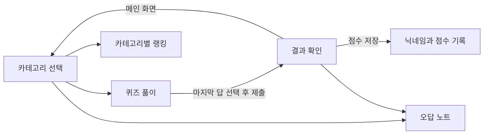

# QuizApp

**영화·음악·게임 퀴즈를 풀고, 점수를 기록하며, 틀린 문제를 복습하는 Android 앱**입니다. Kotlin과 Jetpack Compose로 구현했으며, 카테고리 선택부터 퀴즈, 결과, 랭킹, 오답 노트까지 하나의 앱에서 이용할 수 있습니다.

문제와 효과음은 앱에 포함되어 있어 별도 서버, 로그인, API 키 없이 사용할 수 있습니다.

## 주요 기능

| 기능 | 설명 |
| --- | --- |
| 카테고리 선택 | 영화·음악·게임 중 선택, 해당 카테고리의 퀴즈·랭킹·오답 노트 진입 |
| 4지선다 퀴즈 | 진행도 표시, 선택 직후 정답·오답 테두리와 효과음 제공 |
| 자동 진행 | 마지막 문제를 제외하고 선택 후 약 1초 뒤 다음 문제로 이동 |
| 결과 확인 | 정답 수 / 전체 문항 수, 틀린 문제 수 표시 |
| 점수 저장 | 닉네임·점수·카테고리·날짜를 기록, 빈 닉네임은 `익명`으로 처리 |
| 랭킹 | 점수 내림차순으로 저장한 기록을 카테고리별로 조회 |
| 오답 노트 | 문제·내 답·정답 확인, 카테고리와 닉네임으로 필터링, 개별 삭제 |
| 효과음 | 선택, 시작, 뒤로가기, 제출, 정답·오답에 대한 사운드 |

### 수록 문제

| 카테고리 ID | 이름 | 주제 | 문항 수 |
| --- | --- | --- | --- |
| `movie` | 영화 | 영화 명대사 | 5 |
| `music` | 음악 | 가사로 노래 맞히기 | 5 |
| `game` | 게임 | e스포츠 선수와 소속 팀 | 5 |

총 **15문항**이며, 카테고리별 문제는 소스에 정의된 순서대로 출제됩니다. 무작위 출제나 제한 시간 기능은 없습니다. 채점은 문제 데이터의 `answerIndex`를 기준으로 하므로, 문제 내용과 정답의 사실 여부 및 시점에 따른 변경은 별도 검수가 필요합니다.

## 화면 흐름



1. 카테고리를 선택하고 **퀴즈 시작**을 누릅니다.
2. 각 문제의 보기 하나를 선택합니다. 오답을 고르면 정답 보기도 표시됩니다.
3. 마지막 문제까지 답한 뒤 **제출**을 누르면 점수 계산과 오답 수집이 이루어집니다.
4. 결과 화면에서 닉네임을 입력하고 **점수 저장**을 누릅니다.
5. **오답 노트**에서 복습하거나, 메인 화면으로 돌아가 카테고리를 선택한 뒤 **랭킹 보기**를 누릅니다.

## 기록 저장 방식

> **현재 구현은 `MainActivity.onCreate()`가 호출될 때 랭킹과 오답 기록을 초기화합니다.** 앱을 다시 시작하거나 Activity가 재생성되면 기록이 사라질 수 있으며, 장기 기록 보존 기능으로 사용하기에는 추가 구현이 필요합니다.

| 데이터 | 저장 위치 | 현재 동작 |
| --- | --- | --- |
| 문제 | `QuizData.kt` | 앱에 포함된 정적 목록 |
| 랭킹 | SharedPreferences (`quiz_rank` / `key_rank`) | 전체 카테고리를 합친 상위 10개 기록만 저장, 조회 시 카테고리 필터 적용 |
| 오답 | `WrongAnswerStore`의 메모리 목록 | 실행 중 유지하며 Activity 생성 시 초기화 |
| 퀴즈 진행 | Compose `remember` 상태 | 화면 내부에서 현재 문항과 선택한 답 관리 |

랭킹은 **카테고리마다 10개가 아니라 전체 상위 10개**입니다. 동일 닉네임·점수·총 문항 수·카테고리·날짜가 일치하는 기록은 중복 저장하지 않습니다.

점수를 저장하면 아직 닉네임이 없는 오답들에 입력한 이름을 일괄 지정합니다. 오답 중복 판정은 카테고리·문제 내용·선택한 답으로 이루어지며 닉네임을 포함하지 않으므로, 사용자별 독립적인 학습 기록을 완전히 보장하는 구조는 아닙니다.

## 기술 및 빌드 설정

| 항목 | 저장소 설정 |
| --- | --- |
| 언어 | Kotlin 2.0.21 |
| UI | Jetpack Compose, Material 3 |
| 화면 이동 | Navigation Compose 2.9.6 |
| 효과음 | Android SoundPool |
| Android Gradle Plugin | 8.13.1 |
| Gradle Wrapper | 8.13 |
| SDK | `compileSdk = 36`, `targetSdk = 36`, `minSdk = 24` |
| Java / Kotlin 컴파일 대상 | Java 11 / JVM target 11 |
| 앱 ID | `com.example.mobilesoftwareproject` |

의존성 버전은 [libs.versions.toml](QuizApp-MobileSoftware-master/gradle/libs.versions.toml), 앱 설정은 [app/build.gradle.kts](QuizApp-MobileSoftware-master/app/build.gradle.kts)에서 확인할 수 있습니다. 컴파일 대상 버전과 Gradle 실행에 사용하는 JDK 버전은 구분해야 합니다.

## 실행 방법

### Android Studio

1. 저장소를 내려받습니다.

   ```bash
   git clone https://github.com/taeho01lab-alt/QuizApp.git
   ```

2. Android Studio에서 **`QuizApp/QuizApp-MobileSoftware-master` 폴더**를 엽니다. 저장소 최상위가 아닌, `settings.gradle.kts`가 있는 하위 폴더가 실제 Android 프로젝트입니다.
3. SDK Manager에서 **Android SDK Platform 36**을 설치하고, 프로젝트의 AGP·Gradle에 호환되는 Gradle JDK를 설정합니다.
4. 저장소에 포함된 `local.properties`의 SDK 경로를 본인 컴퓨터에 맞게 설정합니다. 다른 개발자의 로컬 경로를 그대로 사용하면 동기화에 실패할 수 있습니다.
5. Gradle Sync를 완료한 뒤 API 24 이상 에뮬레이터 또는 Android 기기를 선택하고 `app`을 실행합니다.

처음 동기화할 때는 Gradle과 의존성 다운로드를 위한 인터넷 연결이 필요합니다.

### 명령줄 빌드

Windows PowerShell에서 SDK와 Gradle 실행용 JDK를 준비한 뒤 실행합니다.

```powershell
cd QuizApp
cd QuizApp-MobileSoftware-master
.\gradlew.bat :app:assembleDebug
```

macOS/Linux에서는 같은 프로젝트 폴더에서 다음 명령을 사용합니다.

```bash
bash ./gradlew :app:assembleDebug
```

빌드 성공 시 디버그 APK는 프로젝트 폴더 기준 `app/build/outputs/apk/debug/app-debug.apk`에 생성됩니다. 연결된 기기에 설치하려면 Windows에서 `.\gradlew.bat :app:installDebug`를 실행합니다.

## 프로젝트 구조

```text
QuizApp/
├── README.md
└── QuizApp-MobileSoftware-master/
    ├── settings.gradle.kts
    ├── build.gradle.kts
    ├── gradle/libs.versions.toml
    ├── gradle/wrapper/
    ├── gradlew / gradlew.bat
    └── app/
        ├── build.gradle.kts
        └── src/
            ├── main/
            │   ├── AndroidManifest.xml
            │   ├── java/com/example/mobilesoftwareproject/
            │   │   ├── MainActivity.kt
            │   │   ├── data/
            │   │   │   ├── QuizData.kt
            │   │   │   ├── RankingStore.kt
            │   │   │   └── WrongAnswerStore.kt
            │   │   ├── model/QuestionModel.kt
            │   │   ├── navigation/Screen.kt
            │   │   └── ui/theme/
            │   │       ├── CategoryScreen.kt
            │   │       ├── QuizScreen.kt
            │   │       ├── ResultsScreen.kt
            │   │       ├── RankingScreen.kt
            │   │       ├── WrongNoteScreen.kt
            │   │       └── Color.kt / Theme.kt / Type.kt
            │   └── res/          # 아이콘, 색상, 효과음 등
            ├── test/             # 로컬 단위 테스트
            └── androidTest/      # 기기에서 실행하는 테스트
```

`MainActivity.kt`의 `QuizNavHost`가 각 화면과 콜백을 연결하고, `Screen.kt`가 카테고리 ID·점수·전체 문항 수를 포함하는 이동 경로를 정의합니다. 화면 상태는 Compose에서 관리하며, 데이터 처리는 `QuizData`, `RankingStore`, `WrongAnswerStore`로 나뉩니다. `SoundManager`는 `CategoryScreen.kt`에 정의되어 있습니다.

## 문제와 기능 수정하기

기본 소스 경로는 `QuizApp-MobileSoftware-master/app/src/main/java/com/example/mobilesoftwareproject/`입니다.

| 수정할 내용 | 파일 |
| --- | --- |
| 카테고리·문제·보기·정답 | `data/QuizData.kt` |
| 문제·랭킹·오답 데이터 모델 | `model/QuestionModel.kt` |
| 문항 전환 속도·정답 피드백·채점 | `ui/theme/QuizScreen.kt` |
| 결과 화면·닉네임 입력 | `ui/theme/ResultsScreen.kt` |
| 랭킹 정렬·저장 개수 | `data/RankingStore.kt` |
| 오답 중복 판정·필터·삭제 | `data/WrongAnswerStore.kt` |
| 시작 시 기록 초기화·화면 연결 | `MainActivity.kt` |
| 효과음 로딩·재생 | `ui/theme/CategoryScreen.kt`, `app/src/main/res/raw/` |

문제를 추가할 때는 고유한 `id`, 등록된 `categoryId`, 네 개의 보기, **0부터 시작하는** `answerIndex`를 지정합니다. 현재 화면은 해당 카테고리의 실제 문항 수를 사용해 진행도와 결과를 표시합니다.

## 테스트

실제 Android 프로젝트 폴더에서 실행합니다.

```powershell
# 로컬 단위 테스트
.\gradlew.bat :app:testDebugUnitTest

# 에뮬레이터 또는 기기가 필요한 테스트
.\gradlew.bat :app:connectedDebugAndroidTest
```

현재 테스트는 `2 + 2` 계산을 확인하는 기본 단위 테스트와 앱 패키지명을 확인하는 기본 기기 테스트입니다. 퀴즈 채점, 랭킹, 오답 노트를 검증하는 기능 테스트는 아직 없습니다.

이 README는 저장소 소스와 설정을 기준으로 작성했습니다. 문서 작성 과정에서 Android 빌드나 에뮬레이터 실행을 검증하지는 않았습니다.

## 현재 구현의 한계

- 랭킹과 오답은 Activity 생성 시 초기화되며, 온라인 랭킹이나 사용자 계정 동기화는 없습니다.
- 문제 데이터는 코드에 직접 정의되어 있어 문항 추가·정답 수정 후 앱을 다시 빌드해야 합니다.
- 일부 화면에 고정 높이·너비가 사용되어 작은 화면이나 가로 모드에서는 별도 레이아웃 확인이 필요합니다.
- 저장소에는 로컬 SDK 설정, IDE 파일과 Gradle 캐시가 포함되어 있습니다. 다른 환경에서 실행할 때는 본인 SDK 설정을 사용하고 생성 파일과 소스 파일을 구분해 관리해야 합니다.
